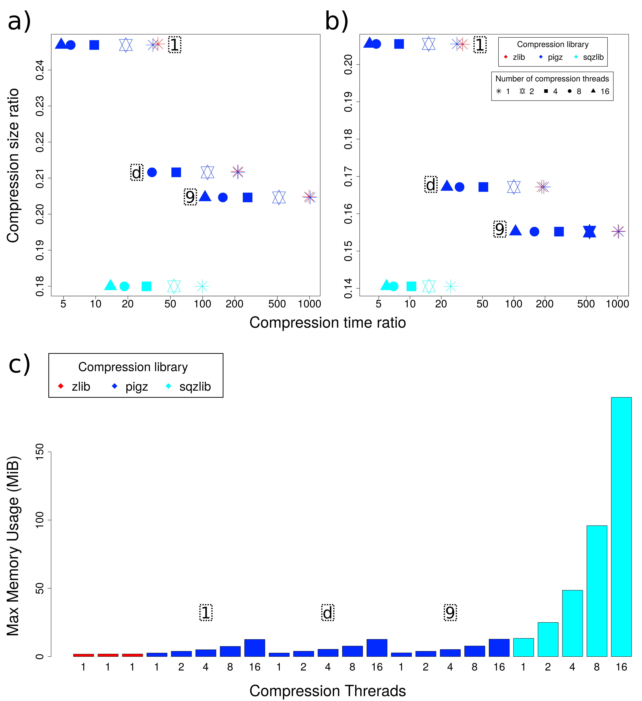

# sqzlib, gzip, pigz Compression time/ratio 

Compression time ratio relative to ”cp” command(xaxis) VS compression size ratio relative to original file size(yaxis) for gzip, pigz and sqzlib at different compression levels(dotted boxes) and CPU threads.

a) HiFi Reads from Fragaria x Annanassa

b) NCBI NT blast database sample

c) Maximum resident size, measured by /usr/bin/time for data in a)
